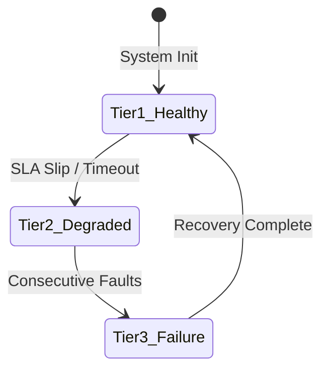

# BDRA Lite: Business-Domain Ring Architecture

### Version 1.5.1 — Canonical Reference Implementation & Developer-Centric Tier

> "Architecture serves the business, not the other way around."  
> — Memonics, 2005
>
>

Traditional software architectures partition systems by technical roles (UI, business logic, database). This obscures what the business actually does, creates sprawling failure domains, and forces simple feature changes to cascade destructively across technical tiers. The architecture ends up serving the engineers when it should serve the business.


While **BDRA Full** addresses infrastructure-level high-availability survival through complex orchestrator-driven automation, **BDRA Lite** focuses entirely on the code engine. It brings concentric ring discipline to mainstream application topologies—such as modular monoliths, virtual machines, and serverless functions—without demanding specialized cloud infrastructure, custom Kubernetes operators, or high-overhead operations platforms.


BDRA Lite shifts the structural focus back to codebase health, optimizing for developer velocity, absolute local testability, and deterministic failure boundarie.

---

## The Architectural Selection Matrix

When evaluating which framework pattern fits your specific deployment requirements, use this quick-reference table:


| Architectural Dimension     | BDRA Lite (Mainstream Tier)                                                                                                                                      | BDRA Full (High-Availability Tier)                                                                                                         |
| --------------------------- | ---------------------------------------------------------------------------------------------------------------------------------------------------------------- | ------------------------------------------------------------------------------------------------------------------------------------------ |
| **Primary Focus**           | **Developer Sanity & Codebase Health:** Eliminating technical debt, guaranteeing clean boundaries, and speeding up feature velocity.                             | **Operational Survival & Business Continuity:** Guaranteeing near-zero downtime in mission-critical environments.                          |
| **Enforcement Gate**        | **Build-Time Linter:** Language-specific AST analysis executed locally or inside automated CI/CD pipelines.                                                      | **Admission Control & Runtime Reconciliation:** Webhooks that block manual cluster changes, backed by a continuous platform control plane. |
| **Terminal Failure State**  | **Tier 3 (Recoverable Failure):** Circuit breakers fail-open, traffic routes to a stale local cache, and internal process supervisors trigger standard restarts. | **Tier 4 (Active Absorption):** The platform control plane dynamically clones the failed inner ring inside the outer ring's namespace.     |
| **Data & State Model**      | Standard shared databases combined with lightweight, resilient API caching primitives (e.g., Redis with a bounded TTL).                                          | Asynchronous, push-based CDC data streams, pre-hydrated snapshots, and pre-authorized dormant database adapters.                           |
| **Compute Scaling**         | Standard container vertical/horizontal scaling or native cloud provider autoscaling.                                                                             | **Automated Overprovisioning:** Immediate, atomic 200% cgroup scale-up that rigidly preserves the Guaranteed QoS class.                    |
| **Hosting Environment**     | **Platform-Agnostic:** Runs seamlessly inside modular monoliths, virtual machines, serverless functions, or bare metal.                                          | **Kubernetes-Native:** Dependent on container orchestrators, service meshes (Istio/Linkerd), and distributed key-value stores (etcd).      |
| **Operational Maintenance** | **Negligible:** Zero specialized infrastructure overhead beyond standard unit testing and build lint checks.                                                     | **High:** Requires dedicated platform tooling, quarterly automated absorption drills, and strict schema evolution tracking.                |


---

## 1. The Topology: Concentric Rings

A **Ring** is the primary structural unit of BDRA. Each Ring maps to exactly one major business domain—never a technical layer, and never a generic utility tier. To ensure strict compatibility with mainstream compiler constraints and directory pathing conventions, rings use consistent, non-hyphenated packaging paths (`ring0`, `ring1`, `ring2`).

```mermaid
graph TD
    subgraph Ring Topology Flow
        R4[Ring 2: Operational Intelligence] --> R1[Ring 1: Transactional Core]
        R1 --> R0[Ring 0: Core Identity]
    end
    style R0 fill:#1e293b,stroke:#334155,stroke-width:2px,color:#fff
    style R1 fill:#0f766e,stroke:#115e59,stroke-width:2px,color:#fff
    style R4 fill:#475569,stroke:#64748b,stroke-width:2px,color:#fff

### The Inward-Flow Invariant
* **Ring 0 (The Identity/Core Core):** Always the innermost, most foundational domain—e.g., Core Identity, Auth, or Tenant Management. No other business domain can function without it.
* **Ring 1 (Transactional Core):** The intermediate operational domain (e.g., Orders, Billing) that sits directly outside the core.
* **Ring 2 (Operational Intelligence):** The analytical or edge domain (e.g., Analytics, Reporting, Extensions) that monitors or reacts to underlying transactions.
* **The Dependency Rule:** Outer rings may depend on inner rings, but inner rings **must never** depend on outer rings. The dependency graph must remain strictly acyclic and flow exclusively inward.
* **Ring Count Rule:** The number of rings is determined by the business—one ring per identifiable critical domain. There is no prescribed minimum or maximum.

### Non-Hierarchical Extensions
Real-world enterprise systems contain domains that do not fit a pure vertical hierarchy. BDRA Lite accommodates these via three flat topology patterns:

| Pattern | When to Use | Key Rule |
| :--- | :--- | :--- |
| **Standard Ring Hierarchy** | Domain A cannot function without Domain B. | B is inner, A is outer. A carries absorption capability for B. |
| **Peer Rings** | A and B interact but neither is foundational to the other. | Same ring level. Circuit breakers required. No absorption between peers. |
| **Event Bus Decoupling** | A and B have bidirectional operational dependencies. | Introduce an event bus ring. A and B publish/subscribe. No direct A-B calls. |
| **Shared Service Rings** | Domain provides infrastructure used by all rings. | Orthogonal to main hierarchy. Business rings consume it; it never depends on them. |

---

## 2. The Code Discipline: Three Isolated Layers

To ensure that changing an API format or database vendor does not corrupt core business invariants, every Ring independently enforces a strict three-layer code discipline. This boundary is maintained code package by code package, ring by ring, rather than once globally across an entire platform.

```mermaid
graph TD
    subgraph Layer Discipline
        Pub[3. PUBLIC LAYER: Infrastructure Adapters] -->|Calls / Depends On| Prot[2. PROTECTED LAYER: Application Ports]
        Prot -->|Calls / Depends On| Pure[1. PURE LAYER: Core Domain Logic]
    end
    style Pure fill:#1e293b,stroke:#334155,stroke-width:2px,color:#fff
    style Prot fill:#0f766e,stroke:#115e59,stroke-width:2px,color:#fff
    style Pub fill:#e2e8f0,stroke:#cbd5e1,stroke-width:2px,color:#000
```


### Layer Definitions


| Layer         | Definition & Rule                                                                                                          | Permitted Imports                                                                                                                                 |
| ------------- | -------------------------------------------------------------------------------------------------------------------------- | ------------------------------------------------------------------------------------------------------------------------------------------------- |
| **Pure**      | Entirely self-contained business logic and core domain rules. Zero infrastructure or technical framework concerns.         | **Zero external dependencies.** Absolute ban on framework imports, network calls, or standard library I/O packages. Only pure functions.          |
| **Protected** | Shared interfaces, contracts, and Data Transfer Objects (DTOs). The ring's published API surface available to outer rings. | May depend on the internal *Pure* layer of the **exact same ring**. **Strictly no external I/O**. Acts as the ring's immutable contract boundary. |
| **Public**    | All integration and infrastructure code. The **only layer** permitted to have external dependencies.                       | Database drivers, HTTP/gRPC controllers, message broker clients, and third-party SDKs. All I/O lives here exclusively.                            |


### The Intra-Ring Dependency Exception

While the framework maintains an absolute ban on external third-party or network I/O packages throughout the inner core, the **Protected layer** is explicitly permitted to inherit data shapes from its sibling **Pure layer** within the *exact same ring boundary*. 


This intra-ring flow allows public interface signatures to explicitly leverage domain entity validation without violating cross-ring data isolation rules. Conversely, outer rings accessing this domain must communicate strictly through the DTO surfaces declared by the Protected layer, guaranteeing no leakage of core domain structures across ring boundaries.


### The Zero-Mock Unit Testing Advantage

Because the **Pure** layer is completely free from I/O and external frameworks, it achieves absolute test isolation. Developers validate critical domain rules using standard, lightning-fast unit tests with zero mocking frameworks, complex suite initializations, or container lifecycles. If an invariant cannot be tested without a mock, it has violated the layer boundary and wrongly leaked into the Pure layer.

---

## 3. Operational Tiers & Non-Orchestrated Recovery

Unlike the Kubernetes-native automation of the Full tier, BDRA Lite delivers self-healing capabilities directly inside standard application runtimes. It manages dependencies gracefully across three operational conditions:




### Tier 1: Healthy

The ring's internals function normally. Background health checks respond within expected service-level metrics, and traffic passes through without impedance.


### Tier 2: Degraded (Transparent Cache Fallback)

When a ring's primary storage or data adapter drops connectivity, local circuit breakers in the caller's layer instantly activate in **fail-open mode**. To maintain business uptime, the ring's Protected layer exposes a `CacheStore` port, allowing the Public layer to transparently fulfill requests by serving stale read-only data from an isolated local or distributed cache engine (e.g., Redis) with a bounded Time-To-Live (TTL).


### Tier 3: Recoverable Failure (Graceful Process Supervision)

If a domain experiences unhandled errors, process panics, or complete responsiveness failure, the local runtime acts as its own supervisor to prevent cascading application crashes:

- **Modular Monoliths:** Governed by an internal supervisor routine (such as a supervised worker loop) that traps process panics, flushes contaminated memory, and restarts the local domain worker routines.
- **Virtual Machines / Bare Metal:** Managed via local OS process supervisors (e.g., `systemd`, `supervisord`) configured to automatically cycle the service binary upon initialization fault signals.
- **Serverless Functions:** Managed by bubbling the initialization fault directly up to the serverless runtime provider, forcing the cloud gateway to discard the contaminated instance and spin up a fresh cold start.

> **The Write-Rejection Mandate:** While a domain undergoes Tier 3 recovery, incoming write operations are **strictly rejected**. Writes are never silently queued or buffered, protecting the system against split-brain states and data residency corruption.

---

## 4. Error Specification & Health Middleware

### The Standardized Error Envelope (`BDRAError`)

To prevent calling clients from parsing inconsistent structures during a domain degradation or active process recovery, all rejected or failed operations must return an **HTTP 503 Service Unavailable** response code carrying a uniform JSON payload format:

```json
{
  "code": "BDRA_DOMAIN_DEGRADED",
  "message": "The requested business domain is operating in a degraded, read-only state.",
  "ringId": "ring1",
  "domain": "transactional-core",
  "timestamp": "2026-06-13T21:40:00Z",
  "remediation": "Write operations are temporarily rejected to protect data residency invariants. Callers must retain the transaction and retry after the cooldown period."
}
```


### Local Health Middleware

Every BDRA Lite domain exposes an out-of-band `/health` monitor to isolate check routines from the primary user execution path. The health middleware runs asynchronously in the background on an independent loop, updating a local memory checkpoint. Probes must be strictly **O(1)** and are forbidden from making blocking network round-trips or live database lock queries during an incoming HTTP request.

---

## 5. Build-Time Enforcement & Language Scope

The structural design principles of BDRA Lite—ring hierarchies, three-layer code separation, and acyclic dependency graphs—are entirely **language-agnostic in principle**. 

However, the core reference implementation tooling is strictly **Go-centric**, utilizing standard Go package pathing and Abstract Syntax Tree (AST) compilation parsing to turn rules into compiler-enforced constraints. Ecosystem expansion modules providing native **TypeScript** (custom ESLint rule sets), **Python** (Pylint plugin extensions), and **Rust** (custom Clippy lint groupings) are managed as community-contributed project lanes.

---

## 📂 The Complete Project Directory Tree Layout

The workspace layout is structured as follows, completely matching our build-time governance validation manifest boundaries:

```text
.
├── .github/
│   └── workflows/
│       └── bdra-lint.yml           # Continuous Integration Governance Gate
├── cmd/
│   └── app/
│       └── main.go                 # Monolith Composition Root & DI Compiler
├── internal/
│   ├── ring0/                      # Ring 0: Core Identity Context
│   │   ├── pure/
│   │   │   └── user.go             # Core User Entities (Zero I/O)
│   │   └── protected/
│   │       └── ports.go            # Identity Boundary Interfaces
│   │   └── public/
│   │       └── service.go          # Mock Identity Resolution Driver
│   ├── ring1/                      # Ring 1: Transactional Core Context
│   │   ├── pure/
│   │   │   ├── order.go            # Core Order Entities (Zero I/O)
│   │   │   └── order_test.go       # Zero-Mock Mathematical Unit Suite
│   │   ├── protected/
│   │   │   ├── errors.go           # Standardized BDRAError Payload Definition
│   │   │   └── ports.go            # Order Persistence & Caching Abstractions
│   │   ├── public/
│   │   │   ├── adapters.go         # Safe Crypto ID & Redis Cache Adapters
│   │   │   ├── http.go             # HTTP Router Router Delivery Adapter
│   │   │   ├── postgres.go         # SQL Storage Infrastructure Adapter
│   │   │   └── service.go          # Service Coordinator & Cache Warming Loops
│   │   └── health/
│   │       ├── health.go           # Asynchronous O(1) Memory Health Monitor
│   │       └── supervisor.go       # Local Process Resilience Supervisor
│   └── ring2/                      # Ring 2: Operational Intelligence Context
│       ├── pure/
│       │   └── analytics.go        # Risk Evaluation Rules (Zero I/O)
│       ├── protected/
│       │   └── ports.go            # Audit Logging Inbound Ports
│       ├── public/
│       │   └── service.go          # Async Event Tracking Adapter
│       └── health/
│           └── health.go           # Independent Ring 2 Health Monitor
├── bdracheck.json                  # BDRA Lite local lint configuration
├── docker-compose.yml              # Local Backing Infrastructure Sandbox
├── go.mod                          # Monolith Module Dependencies Definition
└── Makefile                        # Local Developer Shortcut Automation Command Scripts
```

---

## 🛠️ Getting Started & Sandbox Operations

### Prerequisites

Ensure you have [Go 1.22+](https://go.dev/) and [Docker Compose](https://docs.docker.com/compose/) installed locally.

### 1. Boot the Backing Infrastructure Sandbox

Spin up the local PostgreSQL and Redis sandbox environment containers out-of-band:

```bash
make up
```

### 2. Execute the Lightning-Fast Domain Tests

Validate core domain validation rules using our pure, zero-mock testing suite:

```bash
make test
```

### 3. Run the Monolith Engine

Start up the local composition root and server instance:

```bash
make dev
```

The server will boot on port `:8080`.

### 4. Verify Local Process Resilience Fault Execution

To simulate an active database failure and test the localized supervisor state mutations, run:

```bash
curl -X POST http://localhost:8080/simulate/fault
```

The system will open local circuit breakers and transparently route read paths to serve stale data from the Redis backup layer. Continued system failure causes the service coordinator to mutate to hard **Write-Rejection Mode**, rejecting active mutations with a standardized `BDRAError` payload.

To return the application state machine to its baseline operations, run:

```bash
curl -X POST http://localhost:8080/simulate/recover
```

---

## 🎨 Prior Art & Credits

BDRA Lite is an evolution of modern distributed systems thinking and pattern design. We owe a massive debt to the architectural paradigms that came before us:

- **The Core Philosophy:** The foundational principle that *"Architecture serves the business, not the other way around"* belongs to **Memonics (2005)**.
- **Ports & Adapters:** The three-layer package discipline (`pure`, `protected`, `public`) implemented independently per ring is a direct refinement of Alistair Cockburn's **Hexagonal Architecture**.
- **Bounded Contexts:** Our concentric ring boundaries are heavily influenced by Eric Evans' **Domain-Driven Design (DDD)**, turning conceptual boundaries into compiler-enforced constraints.

